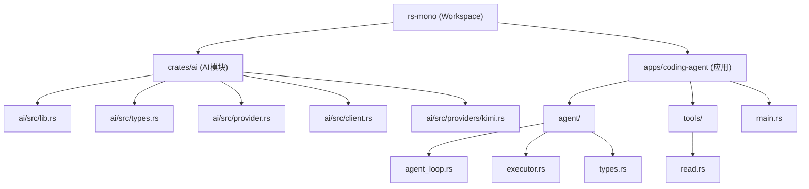
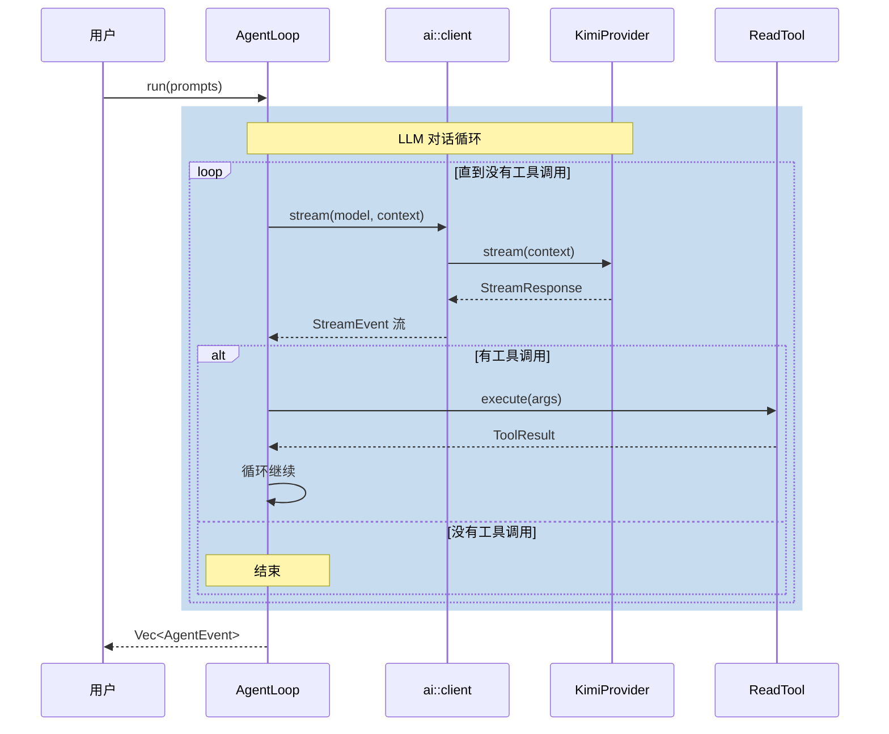
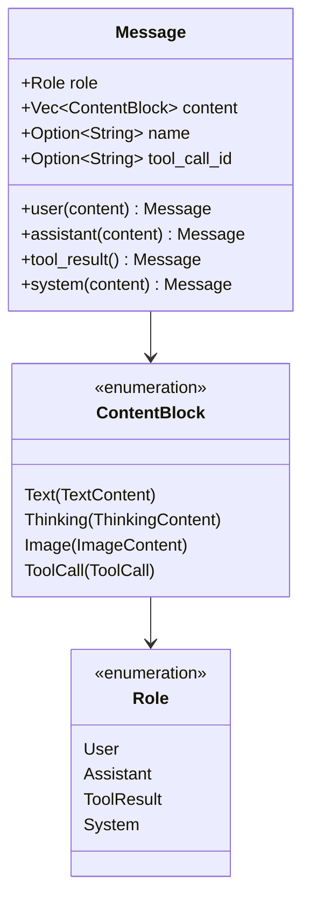
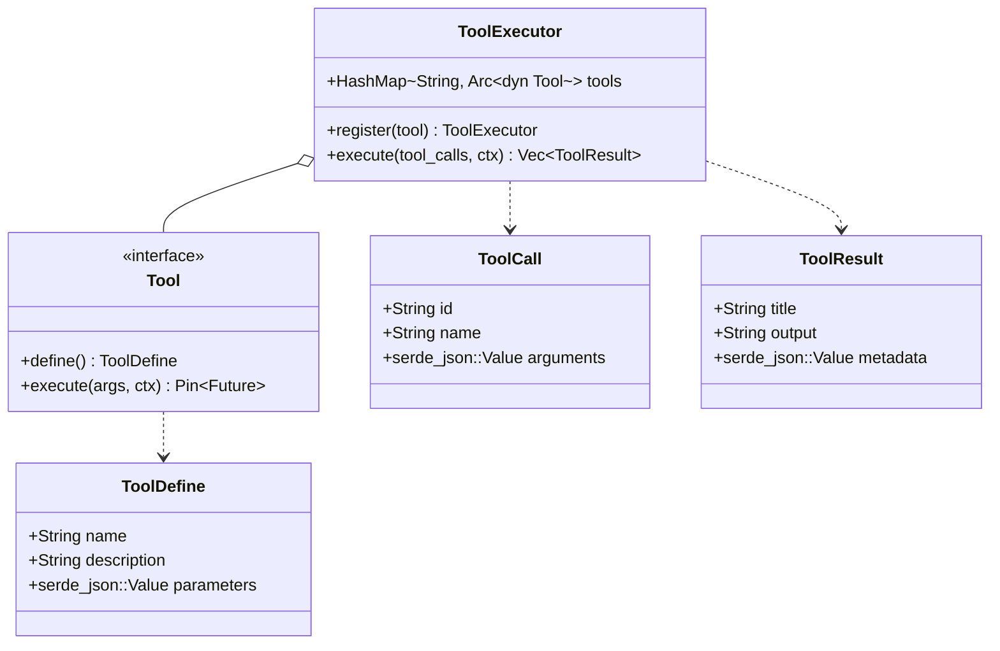
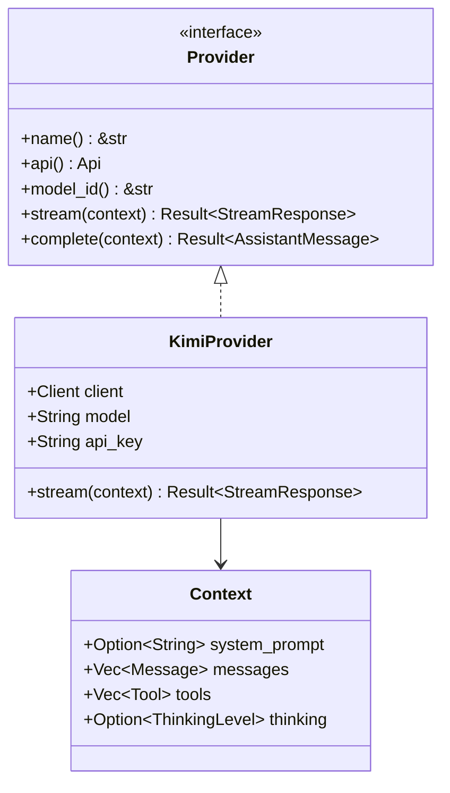
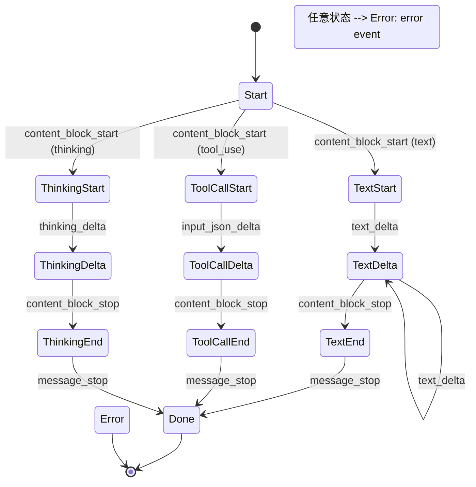
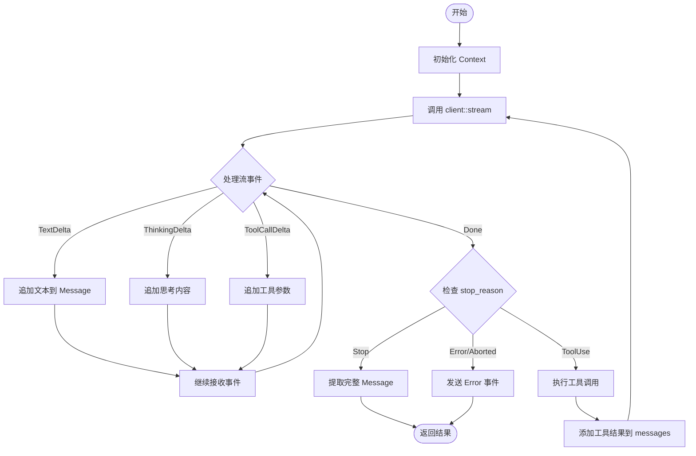
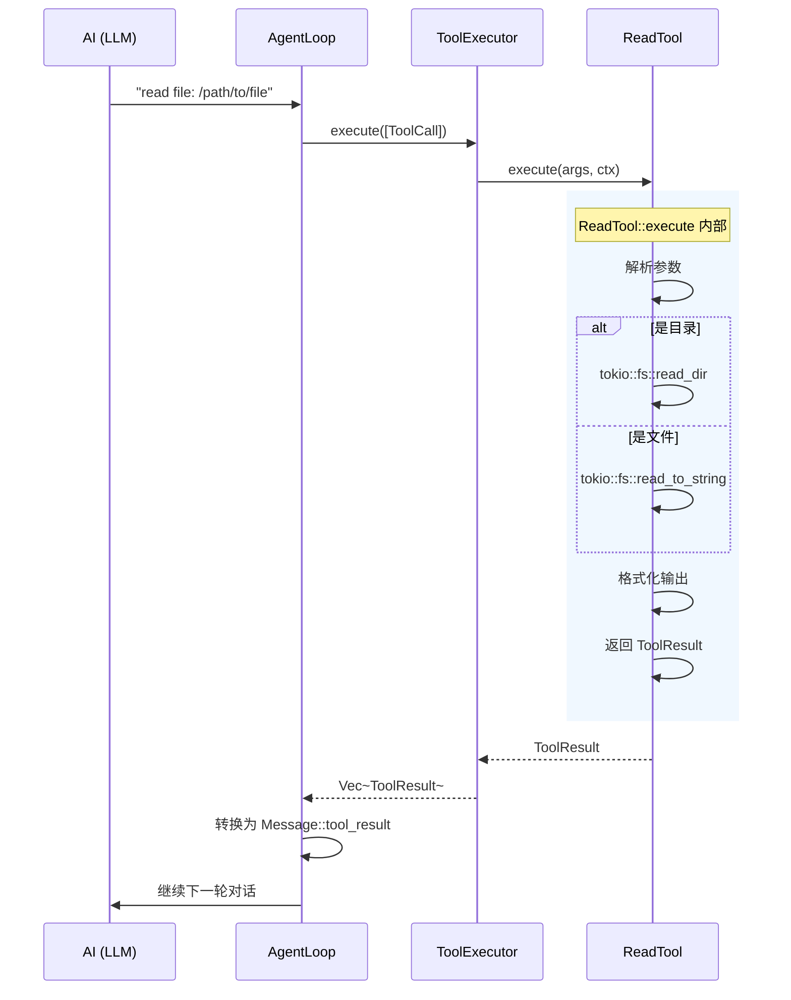

# Coding Agent 源码解读

## 1. 项目概览

### 1.1 项目结构



### 1.2 核心模块职责

| 模块 | 路径 | 职责 |
|------|------|------|
| `ai` | `crates/ai/` | LLM 调用封装：Provider 接口、模型配置、流式响应 |
| `agent` | `apps/coding-agent/src/agent/` | Agent 循环：消息处理、工具调用、状态管理 |
| `tools` | `apps/coding-agent/src/tools/` | 工具实现：ReadTool 等具体工具 |

---

## 2. 数据流架构



---

## 3. 核心类型详解

### 3.1 消息类型 (types.rs)



**示例代码**：

```rust
// 用户消息
let user_msg = Message::user(vec![ContentBlock::text("List files")]);

// Assistant 响应
let assistant_msg = Message::assistant(vec![
    ContentBlock::text("Here are the files:"),
    ContentBlock::tool_call("call_1", "read", json!({"path": "/tmp"}))
]);

// 工具结果
let tool_result = Message::tool_result("call_1", "read", vec![
    ContentBlock::text("file1.rs\nfile2.rs")
]);
```

### 3.2 工具类型 (executor.rs)



**示例**：如何注册一个工具

```rust
// 1. 定义工具
pub struct ReadTool;

impl Tool for ReadTool {
    fn define(&self) -> ToolDefine {
        ToolDefine {
            name: "read".into(),
            description: "Read file contents".into(),
            parameters: json!({
                "type": "object",
                "properties": {
                    "filePath": { "type": "string" }
                }
            }),
        }
    }
    
    fn execute(&self, args: Value, ctx: ToolContext) -> Pin<Box<dyn Future<Output=Result<ToolResult>> + Send>> {
        Box::pin(async move {
            let path = args["filePath"].as_str().unwrap();
            let content = tokio::fs::read_to_string(path).await?;
            Ok(ToolResult::new("read", content))
        })
    }
}

// 2. 注册到 Agent
let agent = AgentLoop::new(config)
    .with_tools(vec![ReadTool::new()]);
```

---

## 4. Provider 接口设计

### 4.1 抽象接口 (provider.rs)



### 4.2 流式事件 (stream_event.rs)



---

## 5. Agent Loop 执行流程

### 5.1 主循环 (agent_loop.rs)



### 5.2 工具执行流程



---

## 6. 关键代码解析

### 6.1 Client 注册机制 (client.rs)

```rust
// 使用 OnceLock 实现全局单例
static REGISTRY: OnceLock<Mutex<ApiProviderRegistry>> = OnceLock::new();

pub fn register_provider<P: Provider + 'static>(provider: P) {
    // 获取或创建注册表
    get_registry().lock().unwrap().register(provider);
}

pub async fn stream(model: &Model, context: &Context) -> Result<StreamResponse> {
    let registry = get_registry().lock().unwrap();
    // 根据 Model.api 查找对应的 Provider
    let provider = registry.get(&model.api)?;
    provider.stream(context).await
}
```

**设计思想**：这种模式允许运行时动态注册不同的 Provider，实现**插件式**的 Provider 加载。

### 6.2 ToolExecutor 的注册模式 (executor.rs)

```rust
#[derive(Clone)]
pub struct ToolExecutor {
    tools: Arc<HashMap<String, Arc<dyn Tool>>>,  // 使用 Arc 支持克隆
}

impl ToolExecutor {
    // 返回新的实例，实现不可变注册
    pub fn register<T: Tool + 'static>(self, tool: T) -> Self {
        let mut new_tools = (*self.tools).clone();
        new_tools.insert(tool.define().name, Arc::new(tool));
        Self {
            tools: Arc::new(new_tools),
        }
    }
}
```

**设计思想**：使用 `Arc<HashMap<...>>` 让 `ToolExecutor` 可以 `Clone`，同时保持内部状态共享。

### 6.3 SSE 流式解析 (kimi.rs)

```rust
struct SseStream<S> {
    inner: S,                    // 原始字节流
    buffer: Bytes,               // 缓冲区
    current_event: Option<String>,
    current_data: String,
}

// 实现 Stream trait，手动解析 SSE 格式
impl<S: Stream> Stream for SseStream<S> {
    fn poll_next(mut self: Pin<&mut Self>, cx: &mut Context<'_>) -> Poll<Option<Self::Item>> {
        loop {
            // 1. 从缓冲区查找行结束符
            if let Some(pos) = find_line_end(&self.buffer) {
                let line = decode_line(&self.buffer[..pos]);
                self.buffer.advance(pos + 1);
                
                // 2. 解析 SSE 字段
                if let Some(colon_pos) = line.find(':') {
                    match &line[..colon_pos] {
                        "event" => self.current_event = Some(value),
                        "data" => self.current_data.push_str(&value),
                        _ => {}
                    }
                }
                
                // 3. 空行表示一个事件结束
                if line.is_empty() && (self.current_data.is_empty() || self.current_event.is_some()) {
                    return Poll::Ready(Some(Ok(SseEvent { ... })));
                }
            }
            // ...
        }
    }
}
```

**SSE 格式示例**：
```
event: message
data: {"type": "content_block_start", "index": 0}

event: ping
data: 

event: message
data: {"type": "content_block_delta", "index": 0, "delta": {"type": "text_delta", "text": "Hello"}}
```

---

## 7. 入口程序解析 (main.rs)

```rust
#[tokio::main]
async fn main() -> anyhow::Result<()> {
    // 1. 初始化 tracing 日志
    tracing_subscriber::registry()
        .with(tracing_subscriber::fmt::layer())
        .init();

    // 2. 创建 Kimi Provider 并注册
    let api_key = std::env::var("KIMI_API_KEY")?;
    let provider = KimiProvider::new("kimi-k2-turbo-preview", api_key);
    register_provider(provider);

    // 3. 获取模型配置
    let model = model_db::get_kimi_model("kimi-k2-turbo-preview")?;

    // 4. 创建 Agent 并注册工具
    let mut agent = AgentLoop::new(AgentLoopConfig::new(model))
        .with_tools(vec![ReadTool::new()]);

    // 5. 构建用户消息
    let prompts = vec![Message::user(vec![ContentBlock::text(
        "List the files in the current directory using the read tool"
    )])];

    // 6. 运行并获取事件流
    match agent.run(prompts).await {
        Ok(events) => {
            for event in &events {
                println!("{:?}", event);
            }
        }
        Err(e) => eprintln!("Error: {}", e),
    }
    Ok(())
}
```

---

## 8. 理解要点

### 8.1 为什么这样设计？

| 设计模式 | 好处 | 示例 |
|----------|------|------|
| **Trait Object (Provider)** | 支持多种 AI 提供商动态替换 | `KimiProvider`, 未来可加 `OpenAIProvider` |
| **Arc + Clone** | ToolExecutor 可自由克隆，状态共享 | `tools: Arc<HashMap<...>>` |
| **Stream abstraction** | 统一处理 SSE、websocket 等多种流 | `StreamResponse` 封装 |
| **OnceLock singleton** | 全局唯一注册表，线程安全 | `REGISTRY: OnceLock<...>` |
| **Builder pattern** | 流畅配置 Agent | `.with_tools().with_reasoning()` |

### 8.2 调试建议

查看流事件：
```rust
// 在 kimi.rs 的 stream 方法中
debug!(data = %data, "SSE");

// 在 client.rs 中
let provider = registry.get(&model.api)?;
// 添加日志
tracing::debug!("Calling provider: {}", provider.name());
```

---

## 9. 下一步探索

1. **扩展 Provider**：参考 `kimi.rs` 实现 `OpenAIProvider` 或 `ClaudeProvider`
2. **添加工具**：在 `tools/` 目录下实现 `BashTool`, `WriteTool` 等
3. **状态持久化**：为 `AgentState` 添加存储机制
4. **流式输出**：将 `AgentEvent` 流式传输到 UI

---

## 10. 快速问答

**Q: 为什么用 `Pin<Box<dyn Future>>`？**
A: 因为 `Tool::execute` 返回的 Future 可能包含引用，需要固定内存位置。

**Q: `AgentLoop::run` vs `run_stream` 区别？**
A: `run` 返回所有事件组成的 Vec，`run_stream` 返回实时 Stream。

**Q: 如何添加新的 AI 提供商？**
A: 实现 `Provider` trait → 在 `providers/` 创建 `xxx.rs` → 在 `main.rs` 注册。
