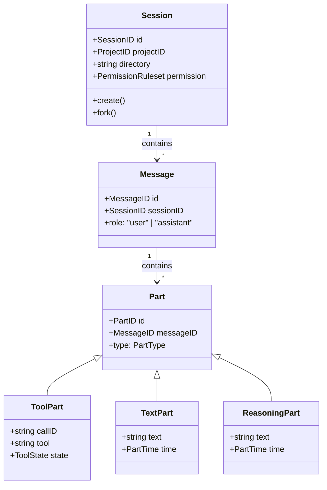
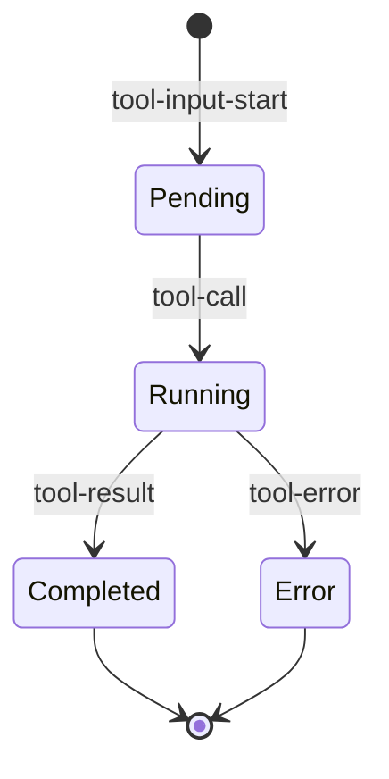
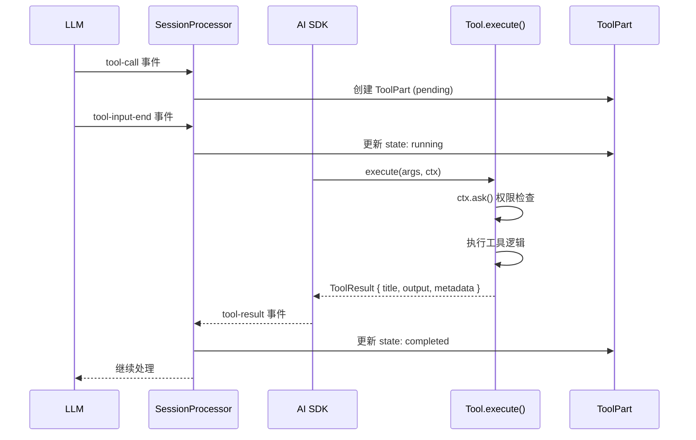
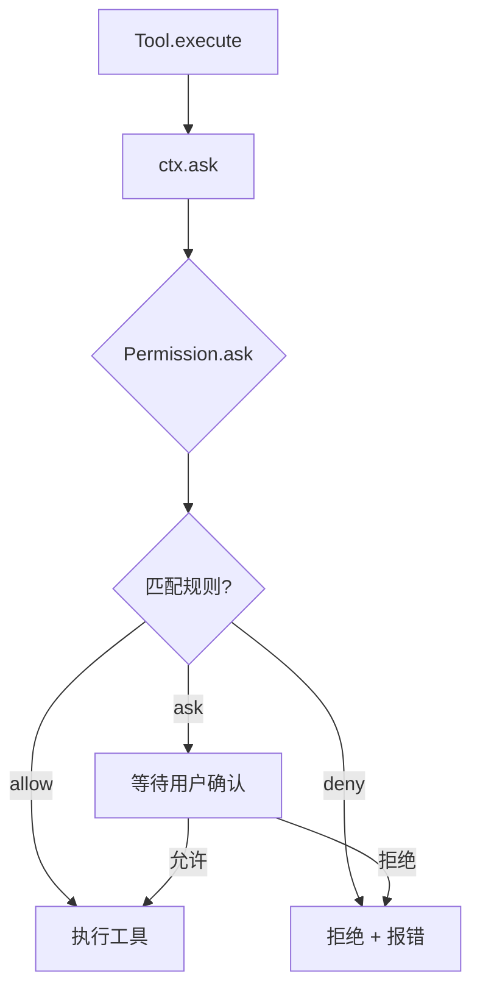

# AgentLoop 详解

本文档详细说明 OpenCode 的 Agent 主循环设计。宏观架构请参考 [ARCHITECTURE.md](./ARCHITECTURE.md)。

## 1. 整体架构

```
┌─────────────────────────────────────────────────────────────┐
│                    SessionPrompt.loop()                       │
│                         主循环入口                           │
│                    while (true) { ... }                    │
└─────────────────────┬───────────────────────────────────────┘
                      │
                      ▼
┌─────────────────────────────────────────────────────────────┐
│                  SessionProcessor.process()                    │
│                    流处理器 (while true)                      │
│                    处理 LLM 流式输出                          │
└─────────────────────┬───────────────────────────────────────┘
                      │
                      ▼
┌─────────────────────────────────────────────────────────────┐
│                       LLM.stream()                           │
│                    模型调用 (Vercel AI SDK)                   │
└─────────────────────────────────────────────────────────────┘
```

## 2. 核心实体关系

### 2.1 类图



### 2.2 实体说明

**Session** - 会话根实体
- 包含多个 Message
- 管理权限规则
- 支持 fork（分叉）

**Message** - 消息
- 角色: user（用户） 或 assistant（AI）
- user 消息包含 agent、model 信息
- assistant 消息包含 finish（完成原因）、cost（费用）

**Part** - 消息内容块
- TextPart: 普通文本
- ReasoningPart: 思考过程
- ToolPart: 工具调用
- FilePart: 文件
- StepStartPart/StepFinishPart: Step 标记

**ToolPart** - 工具调用（核心）

```typescript
interface ToolPart {
  callID: string      // 调用 ID
  tool: string        // "bash", "read", "edit"...
  state: ToolState    // 状态
}
```

## 3. ToolState 状态机

ToolPart.state 的状态流转：



| 状态 | 触发条件 | 含义 |
|------|----------|------|
| `pending` | tool-input-start | 等待参数输入 |
| `running` | tool-call | 工具执行中 |
| `completed` | tool-result | 执行成功 |
| `error` | tool-error | 执行失败 |

```typescript
type ToolState =
  | { status: "pending", input: {} }
  | { status: "running", input: {}, time: { start } }
  | { status: "completed", input: {}, output: "", time: { start, end } }
  | { status: "error", input: {}, error: "", time: { start, end } }
```

## 4. 主循环 - SessionPrompt.loop()

**位置**: `src/session/prompt.ts:278-736`

```typescript
while (true) {
  // 1. 获取历史消息（含压缩过滤）
  let msgs = await MessageV2.filterCompacted(MessageV2.stream(sessionID))
  
  // 2. 找到最后的 user/assistant 消息
  let lastUser: MessageV2.User | undefined
  let lastAssistant: MessageV2.Assistant | undefined
  
  // 3. 检查是否需要退出
  //    模型已生成最终回复（非 tool-calls）时退出
  if (lastAssistant?.finish && 
      !["tool-calls", "unknown"].includes(lastAssistant.finish) &&
      lastUser.id < lastAssistant.id) {
    break
  }
  
  // 4. 创建流处理器
  const processor = SessionProcessor.create({...})
  
  // 5. 调用 LLM 并处理 tool calls
  const result = await processor.process({
    user: lastUser,
    agent,
    permission: session.permission,
    system: [...],
    messages: [...MessageV2.toModelMessages(msgs, model)],
    tools: {...},
  })
  
  // 6. 根据结果决定下一步
  if (result === "stop") break           // 退出循环
  if (result === "compact") {            // 需要压缩
    await SessionCompaction.create({...})
  }
}
```

### 循环控制流

| 返回值 | 含义 | 处理 |
|--------|------|------|
| `"continue"` | 继续下一轮 | 回到循环开始 |
| `"stop"` | 停止 | 退出循环 |
| `"compact"` | 需要压缩 | 执行 compaction 后继续 |

## 5. 流处理器 - SessionProcessor

**位置**: `src/session/processor.ts`

负责处理 LLM 的流式输出事件：

```typescript
async process(streamInput) {
  while (true) {
    // 调用 LLM 获取流
    const stream = await LLM.stream(streamInput)
    
    // 遍历流事件
    for await (const value of stream.fullStream) {
      switch (value.type) {
        // 文本输出
        case "text-start":
          // 创建 TextPart
        case "text-delta":
          // 追加文本内容
        case "text-end":
          // 文本完成
        
        // 思考过程
        case "reasoning-start":
        case "reasoning-delta":
        case "reasoning-end":
        
        // 工具调用
        case "tool-input-start":
          // 创建 ToolPart (pending)
        case "tool-call":
          // 更新为 running
        case "tool-result":
          // 更新为 completed
        case "tool-error":
          // 更新为 error
        
        // Step 标记
        case "start-step":
        case "finish-step":
        
        // 错误/完成
        case "error":
        case "finish":
      }
    }
    
    // 决定下一步
    if (needsCompaction) return "compact"
    if (blocked) return "stop"
    if (error) return "stop"
    return "continue"
  }
}
```

### 5.1 LLM 流事件类型

| 事件 | 说明 |
|------|------|
| `text-start/delta/end` | 文本输出流 |
| `reasoning-start/delta/end` | 思考过程流（支持 extended thinking 的模型）|
| `tool-input-start/delta/end` | 工具输入参数流 |
| `tool-call` | 工具被调用（参数完整）|
| `tool-result` | 工具执行完成 |
| `tool-error` | 工具执行出错 |
| `start-step/finish-step` | LLM reasoning step 标记 |
| `error` | API 错误 |
| `finish` | 完成 |

## 6. 工具生命周期详解

### 6.1 完整流程



### 6.2 Tool 接口定义

**位置**: `src/tool/tool.ts`

```typescript
// 工具定义
interface Info<Parameters, M> {
  id: string
  init: (ctx?) => Promise<{
    description: string
    parameters: Parameters
    execute(args, ctx: Context): Promise<{
      title: string      // 显示给用户的标题
      metadata: M        // 额外元数据
      output: string     // 工具输出文本
      attachments?: FilePart[]  // 附件
    }>
  }>
}

// 工具执行上下文
interface Context {
  sessionID: SessionID
  messageID: MessageID
  agent: string
  abort: AbortSignal       // 可取消
  callID?: string
  messages: WithParts[]    // 历史消息
  metadata(input): void   // 实时更新 metadata
  ask(input): Promise     // 权限请求
}
```

### 6.3 工具定义示例

```typescript
// src/tool/bash.ts
export const BashTool = Tool.define("bash", async () => {
  return {
    description: DESCRIPTION,
    parameters: z.object({
      command: z.string().describe("The command to execute"),
      timeout: z.number().optional(),
      workdir: z.string().optional(),
    }),
    async execute(params, ctx) {
      // 1. 解析参数
      const cwd = params.workdir || Instance.directory
      
      // 2. 权限检查
      await ctx.ask({
        permission: "bash",
        patterns: [params.command],
        always: [commandPrefix],
      })
      
      // 3. 执行命令
      const output = await spawnCommand(params.command, { cwd })
      
      // 4. 返回结果
      return {
        title: params.description,
        metadata: { output, exit: proc.exitCode },
        output,
      }
    },
  }
})
```

### 6.4 工具注册表

**位置**: `src/tool/registry.ts`

```typescript
async function all(): Promise<Tool.Info[]> {
  return [
    InvalidTool,
    QuestionTool,
    BashTool,       // 命令执行
    ReadTool,      // 读文件
    GlobTool,      // 文件匹配
    GrepTool,      // 搜索
    EditTool,      // 编辑
    WriteTool,     // 写文件
    TaskTool,      // 子 agent
    WebFetchTool,  // 网页
    WebSearchTool, // 搜索
    // ... 更多工具
  ]
}
```

## 7. 权限系统

### 7.1 权限规则

```typescript
type PermissionRuleset = [{
  permission: string   // "bash", "read", "edit"...
  action: "allow" | "deny" | "ask"
  pattern: string       // glob pattern
}]
```

### 7.2 示例规则

```typescript
const rules: PermissionRuleset = [
  { permission: "bash", action: "allow", pattern: "git *" },
  { permission: "bash", action: "allow", pattern: "npm *" },
  { permission: "bash", action: "deny", pattern: "sudo *" },
  { permission: "bash", action: "deny", pattern: "rm -rf *" },
  { permission: "read", action: "ask", pattern: "*.env" },
]
```

### 7.3 权限检查流程



## 8. Doomscroll 检测

防止同一工具被反复调用相同参数（死循环）：

```typescript
const DOOM_LOOP_THRESHOLD = 3

// 检查最近 3 个 tool calls
const lastThree = parts.slice(-DOOM_LOOP_THRESHOLD)

if (lastThree.length === DOOM_LOOP_THRESHOLD &&
    lastThree.every(p => 
      p.type === "tool" &&
      p.tool === value.toolName &&
      JSON.stringify(p.state.input) === JSON.stringify(value.input)
    )
) {
  // 检测到重复调用，请求额外权限
  await Permission.ask({
    permission: "doom_loop",
    patterns: [value.toolName],
  })
}
```

## 9. 消息模型转换

MessageV2 与 AI SDK 的 ModelMessage 之间的转换：

```typescript
// AI SDK 使用的格式
type ModelMessage = {
  role: "system" | "user" | "assistant"
  content: string | ContentPart[]
}

// 转换历史消息为 AI SDK 格式
MessageV2.toModelMessages(msgs, model)

// 支持:
// - TextPart → text content
// - ToolPart → tool-call / tool-result
// - ReasoningPart → reasoning content
// - FilePart → file content
```

## 10. 关键设计模式

### 10.1 事件驱动

```typescript
// 发布事件
Bus.publish(MessageV2.Event.Updated, { info })
Bus.publish(MessageV2.Event.PartUpdated, { part })

// 订阅事件
Bus.subscribe(Event.Updated, handler)
```

### 10.2 状态持久化

```typescript
// Session
db.insert(SessionTable).values(toRow(result)).run()

// Message
db.insert(MessageTable).values({ id, session_id, data }).run()

// Part
db.insert(PartTable).values({ id, message_id, data }).run()
```

### 10.3 Defer 清理

```typescript
using _ = defer(() => cancel(sessionID))
// 函数退出时自动清理
```

## 11. 与 Rust 实现对标

| OpenCode (TS) | Rust 实现要点 |
|----------------|--------------|
| `SessionPrompt.loop()` | AgentLoop 主循环 `run()` |
| `SessionProcessor` | LLM 流处理、Tool call 调度 |
| `LLM.stream()` | 模型调用封装 `ai::generate_stream()` |
| `ToolRegistry` | 工具注册表 `HashMap<String, Tool>` |
| `Tool.define()` | 工具定义 `#[derive(Tool)]` |
| `Tool.Context` | Tool 执行上下文 `ToolContext` |
| `Permission.Ruleset` | 权限系统 `Vec<PermissionRule>` |
| `MessageV2` | 消息/Part 数据结构 |
| `Bus` | 事件发布订阅 |

## 12. 关键文件索引

| 文件 | 职责 |
|------|------|
| `src/session/prompt.ts` | 主循环入口 SessionPrompt.loop() |
| `src/session/processor.ts` | 流处理器 SessionProcessor |
| `src/session/llm.ts` | LLM 调用封装 |
| `src/session/message-v2.ts` | 消息/Part 数据结构 |
| `src/tool/tool.ts` | Tool 接口定义 |
| `src/tool/registry.ts` | 工具注册表 |
| `src/tool/bash.ts` | Bash 工具完整示例 |
| `src/tool/edit.ts` | Edit 工具完整示例 |
| `src/permission/permission.ts` | 权限系统 |
| `src/agent/agent.ts` | Agent 配置 |
